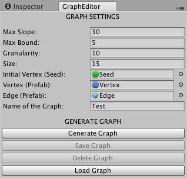
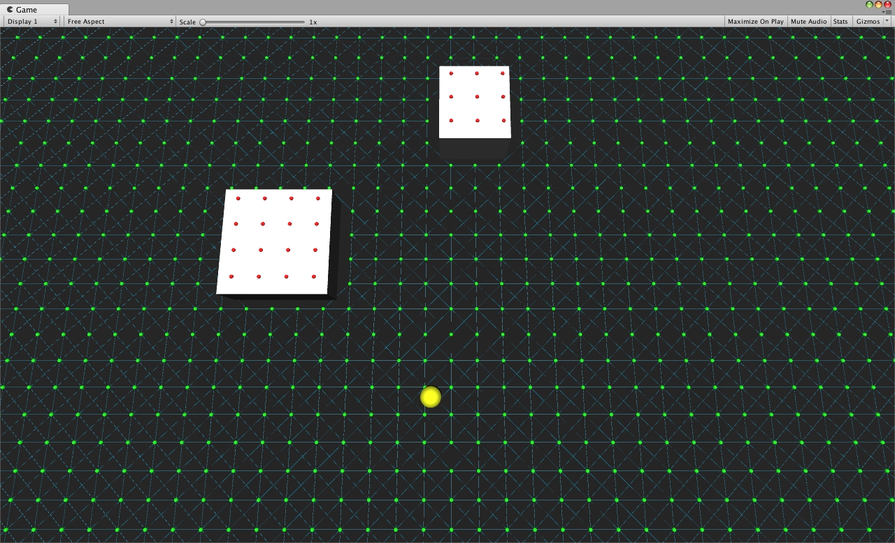

## Artificial Intelligence

Artificial intelligence in Unity using graphs and the pathfinding RTA* algorithm.

## Editor

In the editor you can configure the parameters to be generated.
Besides the option "Generate Graph" also has the options "Save Graph", "Delete Graph" and "Load Graph".

## Play Mode

In this generated graph the green balls represent the available vertices, the red balls represent the unavailable vertices, the blue lines represent the edges. The yellow cylinder represents an NPC from a game, for example.
The NPC (agent) only walks on available vertices and edges that connect these vertices.

The pathfinding RTA* algorithm is being used. In the RTA*, the algorithm analyzes all neighbors of the current vertex to choose the most promising vertex and update the current vertex heuristic with the second best cost value. However, this algorithm discards previously calculated information about the other neighbors.

When starting in Play mode, if something is saved, it will load the graph with the name that was set in the *Inspector*.

## License
Apache 2.0 license. See the [`LICENSE`](LICENSE) file for details.
